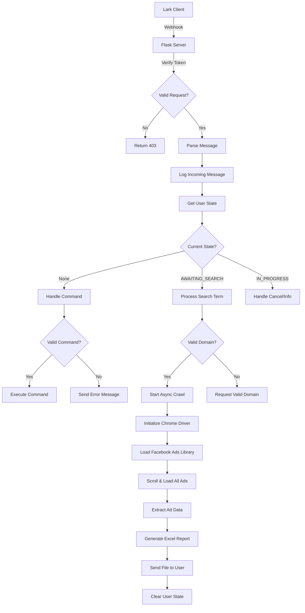
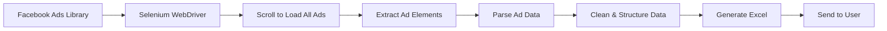
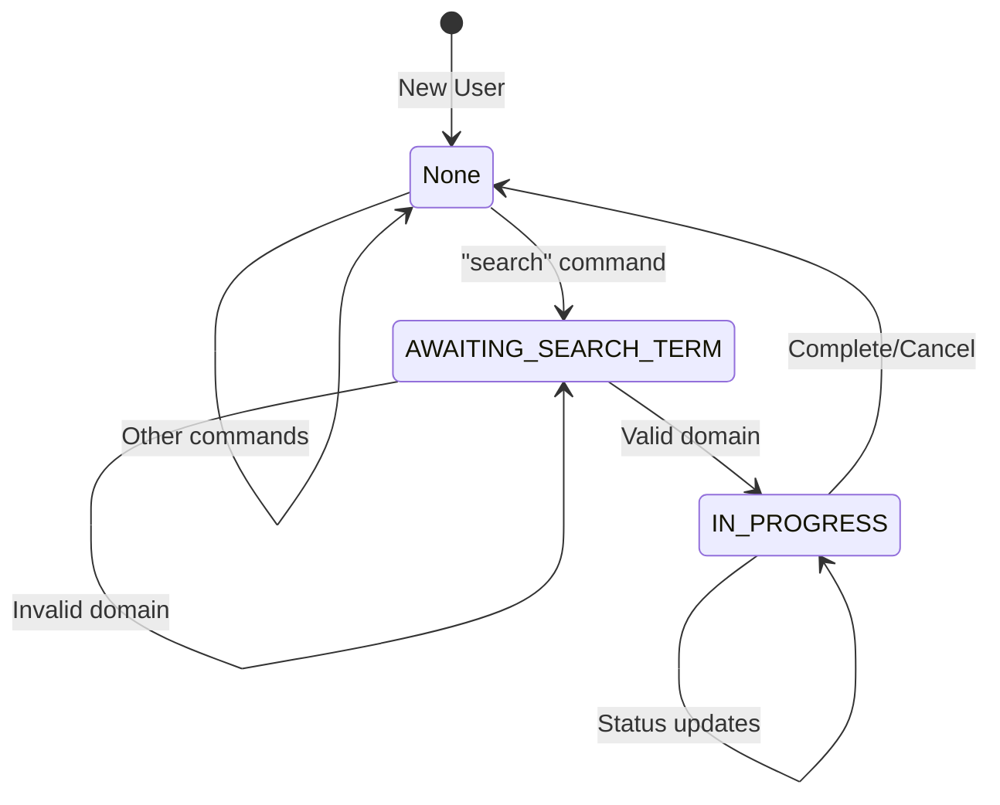

# Facebook Ads Scraper Bot 🤖

A powerful Lark/Feishu chatbot that scrapes Facebook Ads Library data and delivers comprehensive Excel reports. Simply provide a domain name, and the bot will collect all active Facebook ads associated with that domain.

## 📋 Table of Contents

- [Features](#features)
- [Architecture Overview](#architecture-overview)
- [Prerequisites](#prerequisites)
- [Installation](#installation)
- [Configuration](#configuration)
- [Usage](#usage)
- [Data Flow](#data-flow)
- [API Documentation](#api-documentation)
- [File Structure](#file-structure)
- [Deployment](#deployment)
- [Monitoring & Logging](#monitoring--logging)
- [Troubleshooting](#troubleshooting)
- [Contributing](#contributing)

## ✨ Features

### Core Functionality
- **Domain-based Ad Search**: Search Facebook ads by company domain
- **Real-time Progress Updates**: Visual progress bars during scraping
- **Excel Report Generation**: Automated Excel file creation with structured data
- **Cancellation Support**: Stop running processes anytime
- **State Management**: Maintains user conversation states
- **Error Handling**: Comprehensive error management and user feedback

### Data Extraction
- **Library ID**: Unique Facebook ad identifier
- **Ad Start Date**: When the ad campaign began
- **Company Information**: Business name and avatar
- **Pixel Tracking**: Facebook pixel IDs for analytics
- **Destination URLs**: Landing page links
- **Media Content**: Images and videos from ads
- **Ad Type Classification**: Distinguishes between image and video ads

## 🏗️ Architecture Overview

```
┌─────────────────┐    ┌──────────────────┐    ┌─────────────────┐
│   Lark Client   │ ──▶│   Flask Webhook  │ ──▶│  Command Handler │
└─────────────────┘    └──────────────────┘    └─────────────────┘
                                │                        │
                                ▼                        ▼
┌─────────────────┐    ┌──────────────────┐    ┌─────────────────┐
│   Message Log   │ ◀──│   Core Handler   │ ──▶│ State Manager   │
└─────────────────┘    └──────────────────┘    └─────────────────┘
                                │                        │
                                ▼                        ▼
┌─────────────────┐    ┌──────────────────┐    ┌─────────────────┐
│   Excel Report  │ ◀──│ Facebook Crawler │ ──▶│   Lark API      │
└─────────────────┘    └──────────────────┘    └─────────────────┘
```

### Component Breakdown

#### 1. **Flask Webhook Server** (`main.py`)
- Handles incoming Lark webhook requests
- Validates authentication tokens
- Routes messages to appropriate handlers

#### 2. **Command Handler** (`command_handlers.py`)
- Processes user commands and text input
- Manages command routing and validation
- Coordinates asynchronous operations

#### 3. **State Manager** (`state_managers.py`)
- Maintains user conversation states
- Manages process cancellation
- Handles concurrent user sessions

#### 4. **Facebook Crawler** (`tools.py`)
- Selenium-based web scraper
- Extracts ad data from Facebook Ads Library
- Processes images, videos, and metadata

#### 5. **Lark API Client** (`lark_api.py`)
- Handles authentication with Lark platform
- Sends messages and files to users
- Manages API rate limits

#### 6. **File Processor** (`file_processor.py`)
- Converts scraped data to Excel format
- Generates downloadable reports
- Handles file buffer management

## 🔧 Prerequisites

### System Requirements
- Python 3.8 or higher
- Chrome browser (for Selenium)
- ChromeDriver (matching Chrome version)
- Linux/Windows/macOS

### Dependencies
```bash
Flask==2.3.3
selenium==4.15.2
pandas==2.1.1
xlsxwriter==3.1.9
requests==2.31.0
python-dotenv==1.0.0
```

## 🚀 Installation

### 1. Clone Repository
```bash
git clone <repository-url>
cd facebook-ads-scraper-bot
```

### 2. Create Virtual Environment
```bash
python -m venv venv
source venv/bin/activate  # On Windows: venv\Scripts\activate
```

### 3. Install Dependencies
```bash
pip install -r requirements.txt
```

### 4. Install ChromeDriver
```bash
# Ubuntu/Debian
sudo apt-get install chromium-chromedriver

# MacOS
brew install chromedriver

# Windows
# Download from https://chromedriver.chromium.org/
```

### 5. Set Up Environment Variables
Create a `.env` file in the project root:
```env
LARK_APP_ID=your_app_id_here
LARK_APP_SECRET=your_app_secret_here
VERIFICATION_TOKEN=your_verification_token_here
```

## ⚙️ Configuration

### Lark App Setup

1. **Create Lark Application**
   - Go to [Lark Developer Console](https://open.larksuite.com/)
   - Create new app and note App ID and App Secret

2. **Configure Webhook**
   - Set webhook URL: `https://your-domain.com/webhook`
   - Enable "Receive Messages" permission
   - Set verification token

3. **Set Permissions**
   - `im:message:send_as_bot`
   - `im:file:upload`
   - `im:message:read_as_bot`

### Environment Variables

| Variable | Description | Required |
|----------|-------------|----------|
| `LARK_APP_ID` | Lark application identifier | ✅ |
| `LARK_APP_SECRET` | Lark application secret key | ✅ |
| `VERIFICATION_TOKEN` | Webhook verification token | ✅ |

## 🎯 Usage

### Starting the Bot
```bash
python main.py
```

### Available Commands

| Command | Description | Example |
|---------|-------------|---------|
| `help`, `hi`, `start` | Show help menu | `help` |
| `search` | Start interactive search | `search` |
| `search domain.com` | Direct domain search | `search chatbuypro.com` |
| `cancel` | Cancel running operation | `cancel` |

### User Flow

1. **Initiate Search**
   ```
   User: search example.com
   Bot: 🔍 Processing your request. This may take a minute...
   ```

2. **Progress Updates**
   ```
   Bot: 🟩⬜⬜⬜⬜⬜⬜⬜⬜⬜ 10%
   Bot: 🟩🟩🟩🟩⬜⬜⬜⬜⬜⬜ 40%
   Bot: 🟩🟩🟩🟩🟩🟩🟩🟩⬜⬜ 80%
   ```

3. **Results Delivery**
   ```
   Bot: ✅ Search completed successfully!
   Bot: [Excel file attachment]
   ```

## 🔄 Data Flow

### Message Processing Flow



### Data Extraction Process



### State Management



## 📊 API Documentation

### Webhook Endpoint

**POST** `/webhook`

#### Request Headers
```json
{
    "Content-Type": "application/json"
}
```

#### Request Body (URL Verification)
```json
{
    "type": "url_verification",
    "challenge": "verification_string"
}
```

#### Request Body (Message Event)
```json
{
    "header": {
        "event_type": "im.message.receive_v1",
        "token": "verification_token"
    },
    "event": {
        "message": {
            "chat_id": "oc_xxxxx",
            "content": "{\"text\":\"search example.com\"}"
        }
    }
}
```

#### Response
```json
{
    "code": 0
}
```

### Internal API Methods

#### LarkAPI Class
```python
def send_text(chat_id: str, text: str) -> None
def send_file(chat_id: str, file_buffer: BytesIO, filename: str) -> None
```

#### StateManager Class
```python
def set_state(chat_id: str, state: str) -> None
def get_state(chat_id: str) -> str
def clear_state(chat_id: str) -> None
def request_cancel(chat_id: str) -> bool
```

## 📁 File Structure

```
facebook-ads-scraper-bot/
├── main.py                 # Flask webhook server
├── requirements.txt        # Python dependencies
├── .env                   # Environment variables
├── .gitignore            # Git ignore rules
├── README.md             # This documentation
│
├── lark_bot/             # Core bot package
│   ├── __init__.py
│   ├── config.py         # Configuration loader
│   ├── core.py           # Message routing
│   ├── command_handlers.py # Command processing
│   ├── lark_api.py       # Lark API client
│   ├── state_managers.py # State management
│   ├── file_processor.py # Excel generation
│   └── logger.py         # Message logging
│
├── tools.py              # Facebook scraper
├── logs/                 # Log files directory
│   └── chat_logs_YYYY-MM.json
│
└── docs/                 # Additional documentation
    ├── deployment.md
    ├── api_reference.md
    └── troubleshooting.md
```

## 🚀 Deployment

### Local Development
```bash
# Run development server
python main.py
```

### Production with Gunicorn
```bash
# Install gunicorn
pip install gunicorn

# Run production server
gunicorn -w 4 -b 0.0.0.0:5000 main:app
```

### Docker Deployment
```dockerfile
FROM python:3.9-slim

# Install Chrome
RUN apt-get update && apt-get install -y \
    wget \
    gnupg \
    unzip \
    chromium-browser \
    chromium-chromedriver

WORKDIR /app
COPY requirements.txt .
RUN pip install -r requirements.txt

COPY . .
EXPOSE 5000

CMD ["gunicorn", "-w", "4", "-b", "0.0.0.0:5000", "main:app"]
```

### Environment Setup
```bash
# Create production environment
export FLASK_ENV=production
export LARK_APP_ID="your_app_id"
export LARK_APP_SECRET="your_secret"
export VERIFICATION_TOKEN="your_token"
```

## 📈 Monitoring & Logging

### Log Files
- **Location**: `logs/chat_logs_YYYY-MM.json`
- **Format**: JSON with timestamp, chat ID, direction, and message
- **Rotation**: Monthly automatic rotation

### Log Structure
```json
{
    "ts": "2024-01-15T10:30:00",
    "cid": "oc_12345",
    "dir": "i",
    "msg": "search exam...",
    "full": "search example.com"
}
```

### Monitoring Metrics
- Message processing time
- Scraping success rate
- File generation time
- Error frequency
- User engagement

## 🐛 Troubleshooting

### Common Issues

#### 1. ChromeDriver Issues
```bash
# Check Chrome version
google-chrome --version

# Update ChromeDriver
sudo apt-get update && sudo apt-get install chromium-chromedriver
```

#### 2. Permission Errors
```bash
# Ensure proper file permissions
chmod +x chromedriver
sudo chown -R $USER:$USER logs/
```

#### 3. Memory Issues
```bash
# Monitor memory usage
htop

# Increase swap if needed
sudo fallocate -l 2G /swapfile
sudo chmod 600 /swapfile
sudo mkswap /swapfile
sudo swapon /swapfile
```

#### 4. Network Timeouts
- Check Facebook Ads Library availability
- Verify internet connectivity
- Adjust timeout settings in crawler

### Error Codes

| Code | Description | Solution |
|------|-------------|----------|
| 403 | Invalid verification token | Check VERIFICATION_TOKEN |
| 500 | Internal server error | Check logs for details |
| Timeout | Facebook page load timeout | Retry or check network |

### Debug Mode
```bash
# Enable debug logging
export FLASK_DEBUG=1
python main.py
```

## 🤝 Contributing

### Development Setup
1. Fork the repository
2. Create feature branch: `git checkout -b feature-name`
3. Make changes and test thoroughly
4. Submit pull request with detailed description

### Code Standards
- Follow PEP 8 style guidelines
- Add docstrings to all functions
- Include unit tests for new features
- Update documentation for API changes

### Testing
```bash
# Run unit tests (when available)
python -m pytest tests/

# Manual testing checklist
- Test all bot commands
- Verify file generation
- Check error handling
- Test cancellation feature
```

## 📞 Support

For support and questions:
- Create an issue in the repository
- Check troubleshooting guide
- Review logs for error details

---

**Version**: 1.0.0  
**Last Updated**: 22 July 2025  
**Maintainer**: Cody