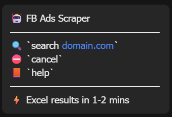
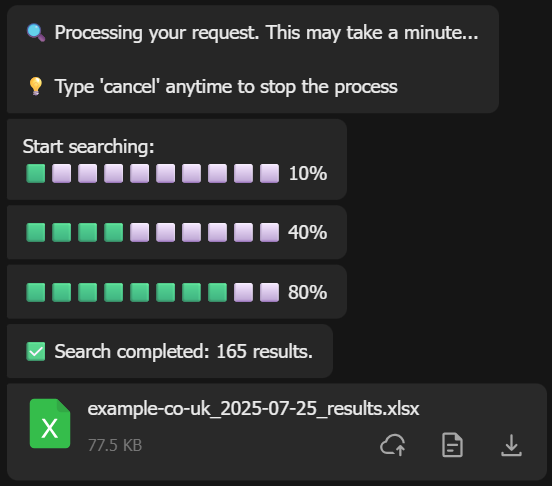
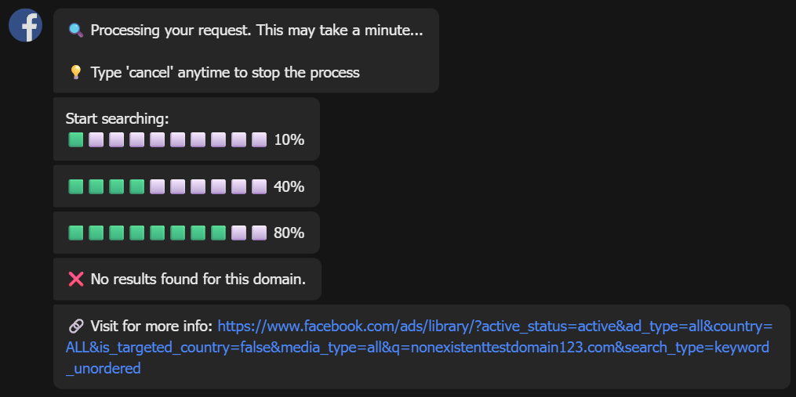
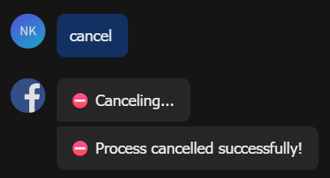
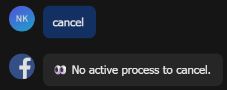

# Lark Bot Search - User Guide

## Welcome to Lark Bot! 🤖

This friendly guide will help you get the most out of your Lark Bot search functionality. Whether you're a first-time user or need a quick refresher, we've got you covered!

## Getting Started

### What Can Lark Bot Do?
Lark Bot helps you search for domain-related information quickly and efficiently. Simply send a command in your Lark chat, and the bot will process your request and deliver results in an easy-to-read Excel file.

### Basic Setup
Before you begin:
- Make sure you have access to the Lark group/channel where the bot is active
- Ensure you can view Excel files on your device
- That's it! No special installation required.

---

## How to Use Lark Bot

### Getting Help
Not sure what to do? Just ask for help!

**Commands to try:**
- `help`
- `hi` 
- `start`

The bot will respond with a comprehensive help menu showing all available commands and how to use them.

**Example:**
```
You: help
Bot: [Displays complete help menu with all available commands]
```



---

#### What Happens When You Search:
1. **Confirmation Message**: The bot confirms it's processing your request
2. **Progress Updates**: You'll see progress indicators (🟩⬜⬜⬜⬜) showing the search status
3. **Results Delivery**: When complete, you'll receive:
   - A completion message with the number of results found
   - An Excel file containing all the detailed information



---

### When No Results Are Found

Sometimes a domain might not have any results. Don't worry - the bot will let you know why!

**Example:**
```
You: search nonexistenttestdomain123.com
Bot: No results found for this domain. 
     You might want to check the Facebook Ads Library directly: [link provided]
```

The bot will provide a helpful link to Facebook Ads Library as an alternative resource.



---

### Canceling a Search

Need to stop a search in progress? No problem!

**Command:** `cancel`

**Example:**
```
You: search amazon.com
Bot: Processing your request...
You: cancel
Bot: Canceling...
```


If you try to cancel when there's no active search, the bot will politely let you know: "No active process to cancel."



---

## Tips for Best Results

### ✅ Valid Domain Formats
**Good examples:**
- `chatbuypro.com`
- `thaidealzone.com` 

### ❌ Invalid Domain Formats to Avoid
**These won't work:**
- `invalid@domain.com` (contains @ symbol)
- `a.com` (too short)
- `no-dots` (missing domain extension)

### 🔧 Domain Format Tips
- Stick to basic domain format: `name.extension`
- Ensure the domain is truly valid

---

## Common Scenarios

### Multiple Users
If several people are using the bot at the same time, don't worry! The bot handles requests one at a time:

```
User 1: search amazon.com
User 2: search microsoft.com
Bot: You are #2 in queue. Please wait...
```

Everyone gets their turn, and the bot processes requests fairly in order.

### Error Messages
If something goes wrong, the bot will give you clear, helpful error messages:

**Common errors:**
- **Unrecognized command**: Suggests using `help` to see available commands
- **Missing domain**: Reminds you to include a domain name

---

## Frequently Asked Questions

**Q: How long does a search take?**
A: Most searches complete within 1 minute, depending on the number of results on Facebook Library.

**Q: What format are the results in?**
A: Results are delivered as Excel files that you can open with any spreadsheet application.

**Q: Can I search multiple domains at once?**
A: Currently, the bot processes one domain at a time. Submit separate requests for multiple domains.

**Q: What if I make a typo in my domain name?**
A: If you have an active search running, use `cancel` first. After that resend a new search command with the correct domain name.

**Q: The bot isn't responding - what should I do?**
A: Wait 30 seconds and try again. If the issue persists, contact your system administrator - Cody0002.

---

## Quick Reference

| Command | Purpose | Example |
|---------|---------|---------|
| `help`, `hi`, `start` | Get help and available commands | `help` |
| `search [domain]` | Search for domain information | `search chatbuypro.com` |
| `cancel` | Stop current search | `cancel` |

---

## Need More Help?

If you encounter any issues or have questions not covered in this guide:

1. Try the `help` command for the most up-to-date information
2. Contact your system administrator
3. Check with your team lead for additional support

---

**Happy Searching! 🚀**

*Last updated: July 25, 2025*